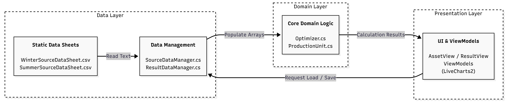

# Danfoss Heat Production Optimizer

A desktop application for optimizing district heating production across different seasons, production assets, electricity prices, and maintenance constraints.

This repository was built for the Semester Project 2 Danfoss case by Group 7. The application helps compare heat production strategies for a district heating utility and presents the results through an Avalonia UI dashboard with charts and text reports.



## What the App Does

- Optimizes hourly heat production using summer and winter demand data.
- Supports two Danfoss production scenarios:
  - **Scenario 1:** heat-only optimization based on production cost.
  - **Scenario 2:** heat and electricity optimization based on net production cost.
- Models six production units: gas boilers, an oil boiler, a gas motor, and an electric boiler.
- Lets users configure planned maintenance windows for production units.
- Warns when selected maintenance may leave heat demand unmet.
- Visualizes heat production, heat demand, CO2 emissions, net production cost, and electricity price.
- Separates data loading, optimization, result formatting, and UI presentation using MVVM.

## Tech Stack

- **Language:** C#
- **UI:** Avalonia UI
- **Architecture:** MVVM
- **Charts:** LiveCharts2
- **Testing:** xUnit
- **Data:** CSV source files for summer and winter time series

## Project Structure

```text
SPG7/
+-- DanfossSPGroup7/                 # Avalonia desktop application
|   +-- Data/                        # Asset, source data, and result data managers
|   +-- Domain/                      # Optimization and production unit logic
|   +-- UI/                          # Views and ViewModels
+-- DanfossSPGroup7.Tests/           # Unit and ViewModel tests
+-- ReportSemesterProjectDanfoss/    # Semester report, diagrams, and documentation
+-- DanfossSPGroup7.sln              # Visual Studio solution
+-- README.md
```

## Requirements

- .NET 9 SDK to build and run the desktop app.
- .NET 10 SDK to run the current test project, because `DanfossSPGroup7.Tests` targets `net10.0`.
- Visual Studio 2022 or another IDE with Avalonia/.NET support is recommended, but not required.

Check installed SDKs with:

```bash
dotnet --list-sdks
```

## Getting Started

Clone the repository and restore dependencies:

```bash
git clone <repository-url>
cd SPG7
dotnet restore DanfossSPGroup7.sln
```

Run the application:

```bash
dotnet run --project DanfossSPGroup7/DanfossSPGroup7.csproj
```

Build the solution:

```bash
dotnet build DanfossSPGroup7.sln
```

Run the tests:

```bash
dotnet test DanfossSPGroup7.Tests/DanfossSPGroup7.Tests.csproj
```

## Data Files

The optimizer reads static CSV source data from:

```text
DanfossSPGroup7/Data/Source Data Manager/SummerSourceDataSheet.csv
DanfossSPGroup7/Data/Source Data Manager/WinterSourceDataSheet.csv
```

Each row contains:

```text
Time,HeatDemand,ElectricityPrice
```

The CSV files are copied to the build output automatically by the project file.

## Optimization Model

The core optimization logic is in `DanfossSPGroup7/Domain/Optimizer.cs`.

For every hour in the selected season, the optimizer:

1. Reads heat demand and electricity price from the source data.
2. Filters out production units that are unavailable due to maintenance.
3. Sorts the remaining units according to the active scenario.
4. Allocates heat production until the hourly demand is covered or capacity is exhausted.
5. Sends the result to the ViewModel for charts and text reporting.

Net production cost is calculated from production cost and electricity price, allowing Scenario 2 to account for units that consume or produce electricity.

## Main Modules

- **Asset Manager:** stores production unit definitions, capacity, costs, emissions, and images.
- **Source Data Manager:** loads summer and winter heat demand and electricity price time series from CSV.
- **Optimizer:** calculates hourly production schedules for both scenarios.
- **Result Data Manager:** prepares optimization results for CSV-style export.
- **Data Visualization:** displays configuration screens, result summaries, and charts in Avalonia.

## Report

The semester report is available in:

```text
ReportSemesterProjectDanfoss/
```

It contains the project explanation, sprint process, architecture diagrams, UML diagrams, implementation notes, reflection, and appendix material.

## Team

Semester Project 2 - Danfoss case  
Group 7
